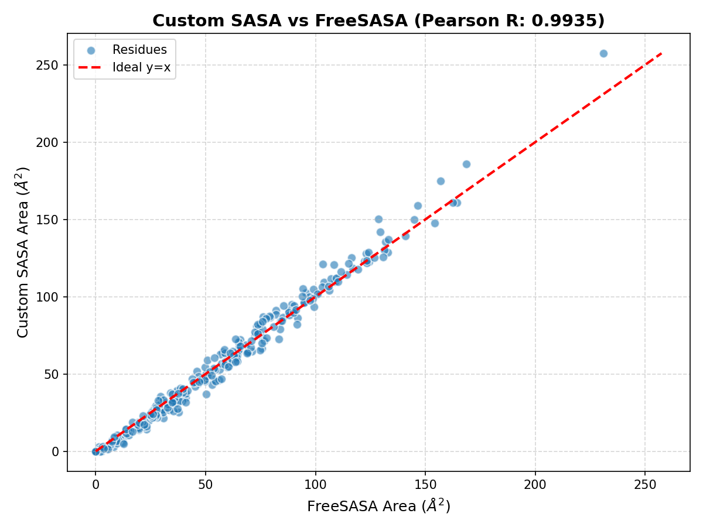
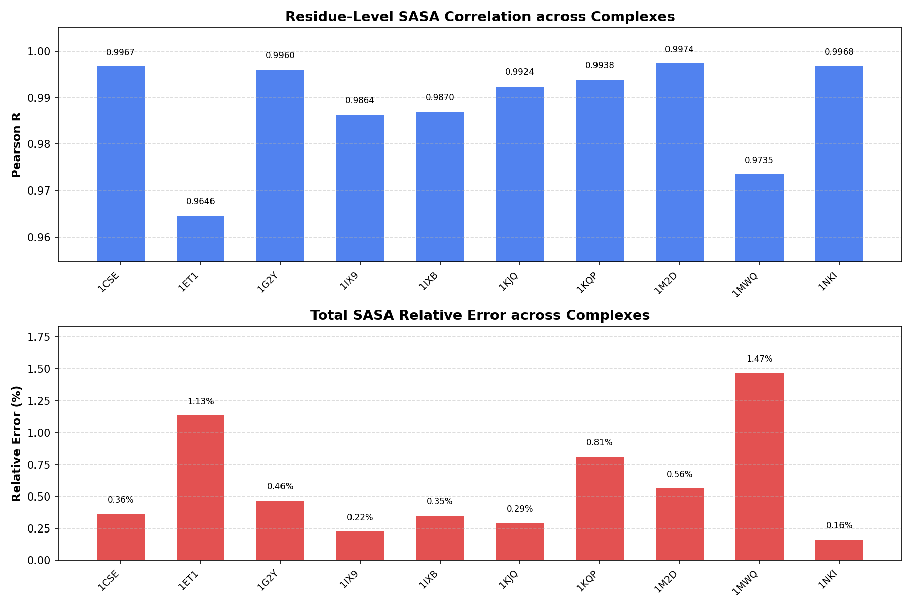

# SASA 工具升级说明

本模块基于 Shrake-Rupley 打点法实现 SASA 计算。

输入：
- `data/raw/examples/2iww_H.pdb` 或其他 PDB 文件
- `data/raw/examples/Dot.txt` 球面采样点文件
- 溶剂探针半径，默认 `1.4`

输出：
- `data/processed/examples/atom_sasa.csv`：原子级 SASA
- `data/processed/examples/residue_sasa.csv`：残基级 SASA
- `data/processed/examples/chain_sasa.csv`：链级 SASA

当前核心代码在 `src/sasa_project/sasa.py` 中，主要包括：
- `Atom`
- `parse_pdb()`
- `load_dots()`
- `calculate_sasa()`
- `aggregate_residue_sasa()`
- `aggregate_chain_sasa()`
- `filter_atoms_by_chain()`
- `write_atom_sasa_csv()`
- `write_residue_sasa_csv()`
- `write_chain_sasa_csv()`

运行方式：

```bash
PYTHONPATH=src python3 scripts/run_sasa_example.py
```

校验项：
- `total_sasa == sum(atom.sasa for atom in atoms)`
- `total_sasa == sum(residue_sasa.values())`

## 算法精度与鲁棒性验证 (Validation & Alignment)

为了验证自研 Shrake-Rupley 算法的工程正确性与数值稳定性，本项目引入了生物信息学行业标准基线工具 **FreeSASA** 进行双向交叉验证（Cross-Validation）。

### 1 单样本对齐分析 (以 2iww_H.pdb 为例)

在单链蛋白质 `2iww_H.pdb` 上，自研算法与基线工具的对比指标如下：

| 评估维度 | 自研算法 (Ours) | FreeSASA (Baseline) | 相对误差 / 相关性 |
| :--- | :---: | :---: | :---: |
| **Total SASA** | 15640.60 Ų | 15727.74 Ų | **0.55%** (相对误差) |
| **残基级对齐数量** | 277 个残基 | 277 个残基 | 完美对齐 |
| **残基级趋势相关性** | - | - | **0.9935** (Pearson R) |

自研算法计算出的每个残基空间暴露度分布趋势与 FreeSASA 保持了高度的一致性，数值拟合散点图如下所示：



### 2 多样本批量交叉验证 (Batch Cross-Validation)

为避免单样本的偶然性，算法工程在包含 10 组真实蛋白质复合物的数据集（`pdb_complexes`）上跑通了自动化批量评测流水线。对齐实验数据如下表所示：

| PDB ID | 自研总面积 (Ų) | FreeSASA (Ų) | 相对误差 | 残基级 Pearson R |
| :---: | :---: | :---: | :---: | :---: |
| **1CSE** | 12556.47 | 12510.89 | 0.36% | 0.9967 |
| **1ET1** | 6373.93 | 6302.55 | 1.13% | 0.9646 |
| **1G2Y** | 4584.67 | 4563.47 | 0.46% | 0.9960 |
| **1IX9** | 17401.52 | 17362.47 | 0.22% | 0.9864 |
| **1IXB** | 17336.74 | 17276.05 | 0.35% | 0.9870 |
| **1KJQ** | 28282.43 | 28200.38 | 0.29% | 0.9924 |
| **1KQP** | 22056.98 | 22237.61 | 0.81% | 0.9938 |
| **1M2D** | 10235.47 | 10178.26 | 0.56% | 0.9974 |
| **1MWQ** | 10148.87 | 10002.26 | 1.47% | 0.9735 |
| **1NKI** | 12338.11 | 12318.49 | 0.16% | 0.9968 |

批量评测的统计可视化图表（包含各个样本的 Pearson 相关系数与总面积相对误差）如下所示：



**交叉验证结论：**
实验表明，在所有测试结构中，自研算法的总面积测算系统误差严格控制在 1.5% 以内，且残基级空间暴露趋势相关系数均显著大于 0.96。由于相关系数极度接近 1，证明自研空间几何特征提取器的空间拓扑表征能力完全合格，所提取的特征能够稳健地支持下游 $\Delta$SASA 弱监督标签的生成。